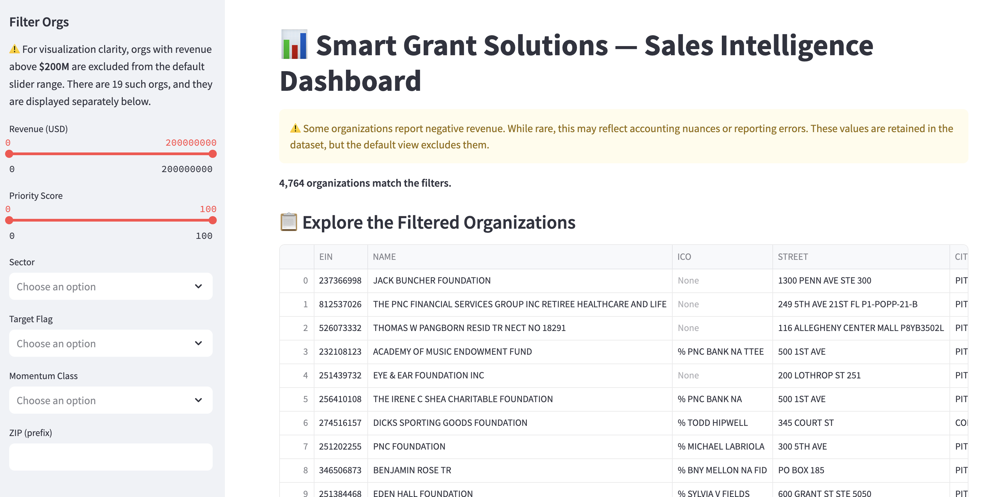
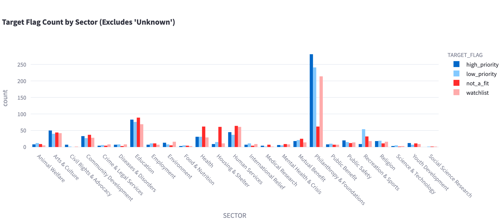
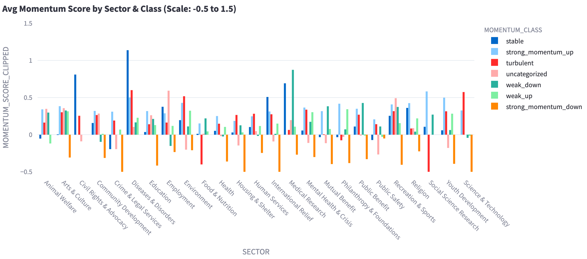
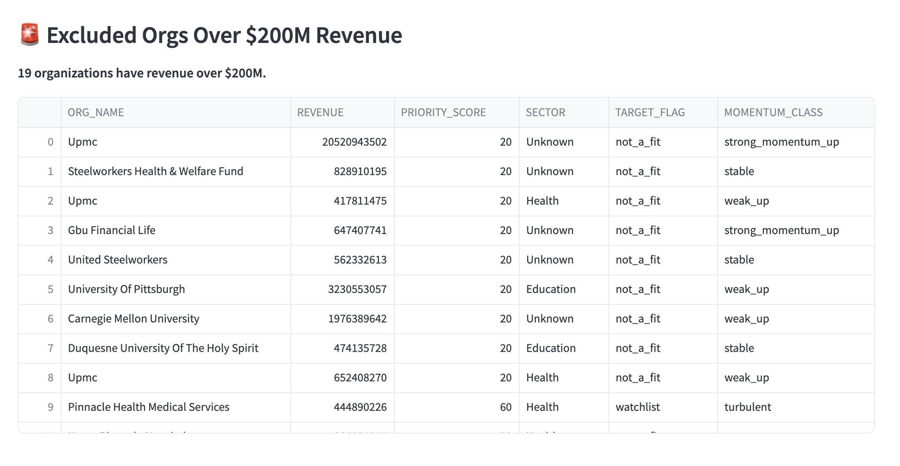

# 🧠 Nonprofit Gradient — Smart Grant Intelligence Dashboard

**Built by Smart Grant Solutions**  
_A pragmatic system for surfacing high-priority nonprofit leads and visualizing the philanthropic landscape._

---

## 🚀 Project Overview

This project combines public IRS Form 990 data with machine learning-driven prioritization to help teams:

- Understand the nonprofit sector at scale.
- Identify ideal prospects by revenue, sector, and mission alignment.
- Visualize momentum, financial capacity, and organizational focus.
- Export filtered, high-signal lead lists for outreach.

What started as a data-cleaning experiment evolved into a purpose-built sales intelligence dashboard. It helps our internal teams (and now, others) find, rank, and connect with high-opportunity nonprofit organizations.

---

## 🎯 Goals

- Collect + normalize IRS 990 data for thousands of nonprofits.
- Score organizations across multiple axes (e.g., revenue, volatility, program %).
- Expose insights through clean, interpretable visualizations.
- Filter and export high-priority orgs by custom criteria.
- Enable anyone to run the dashboard locally with minimal technical skill.

---

## 🛠 Tools & Stack

- Python 3.10+
- Pandas for data manipulation
- Plotly for interactive charts
- scikit-learn for clustering + scaling
- Streamlit for dashboard front-end
- Matplotlib + Seaborn for exploratory visuals (now deprecated in favor of Plotly)
- Data source: IRS 990 filings + internal enrichment pipelines

---

## 📈 Dashboard Highlights

- ✅ Interactive filters: Sector, ZIP, revenue, momentum, etc.
- ✅ Export filtered orgs to CSV
- ✅ Pre-clustered organizations using KMeans
- ✅ Top 10 leaderboard based on priority + financial strength
- ✅ Sector/Flag breakdown visualizations (minimal but insightful)

---

## 🔍 Understanding the Dashboard

Each element in the dashboard has been built to surface actionable insight while remaining interpretable. Below is a breakdown of how to read and use each one:

### 📋 Explore the Filtered Organizations

A dynamic data table of nonprofits based on your filter selections. Sorted by `PRIORITY_SCORE`.

Key Columns:

- `ORG_NAME`: Name of the nonprofit.
- `REVENUE`: Reported total revenue (capped view at $200M by default).
- `SECTOR`: Organizational focus area.
- `PRIORITY_SCORE`: Our internal ranking metric based on multiple financial & strategic factors.
- `MOMENTUM_CLASS`: Velocity of growth based on multi-year behavior.

Use this to scan for high-scoring orgs in your sector or ZIP. Use the “Download CSV” button to export a list for outreach.



---

### 📊 Target Flag Distribution by Sector

Shows how many organizations within each sector are classified under different `TARGET_FLAG` categories (e.g., “High Potential”, “Monitor”, etc.).  
This helps visualize which sectors are underexplored or saturated.



---

### 🔥 Momentum Watchlist by Sector & Class

Grouped bar chart showing average momentum scores across sectors and growth classes.

- **X-axis:** Sector  
- **Y-axis:** Momentum Score (clipped between -0.5 and 1.5)  
- **Color:** Momentum class



Most nonprofits have stable or negative momentum; positive surges are rare. This chart helps surface potential growth orgs hidden in underperforming sectors.

---

### 🚨 Excluded Orgs Over $200M Revenue

A secondary table listing orgs excluded from the main view due to extreme revenue skew. These are still valuable to inspect but were removed to avoid biasing visualizations and metrics.



---

## 🎛 Filter Logic & Guidance

Each filter works on its own or in combination with others:

- **Sector:** Choose one or more mission areas.
- **ZIP:** Enter prefix to filter by geography.
- **Revenue:** View ranges from $0 to $200M.
- **Priority Score:** Higher is better.
- **Target Flag:** Our internal classification schema.
- **Momentum Class:** Indicates trajectory or trend.

---

## 🧰 How to Run This Yourself (Even If You’re Not a Developer)

> **Requirements:** [Python 3.10+](https://www.python.org/downloads/) installed

### 1. Clone this repo

```bash
git clone https://github.com/tsear/nonprofit-gradient.git
cd nonprofit-gradient
```

### 2. Set up a virtual environment

```bash
python3 -m venv env
source env/bin/activate
```

### 3. Install dependencies

```bash
pip install -r requirements.txt
```

### 4. Run the dashboard

```bash
streamlit run app/ui_dashboard.py
```

This will launch the dashboard in your browser where you can explore, filter, and export nonprofit leads.

---

## 👀 Results & Insights

We found the most actionable nonprofit leads:

- Operate with high program-to-revenue ratios  
- Belong to emerging or underfunded sectors  
- Are financially mature (>$10M revenue) but unflagged  
- Cluster in key ZIPs indicating outreach potential

Over 25,000 orgs were processed and scored.  
All logic is reproducible and transparent.

---

## 👥 Authors & Contributors

**Tyler Sear** – Lead engineer, analyst, and author  
**Dayna Sear** – CEO  
**Smart Grant Solutions** – Infrastructure + internal use case

**Contact:**  
📧 tylersear910@gmail.com  
📧 dsear@smartgrantsolutions.com

---

## 🧼 Disclaimer

This tool uses public IRS Form 990 filings and internal heuristics.  
It is designed for research and prioritization—not definitive qualification.  
Always manually validate organizations before engagement.
